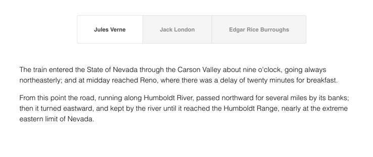

## [Tuts+ - JavaScript For Web Designers / Tab Control](https://webdesign.tutsplus.com/courses/javascript-for-web-designers)

In this tutorial, we learn how to use JavaScript to code a tab control.

[View your demo site here.](https://webdevtuts.github.io/tab_control/)

